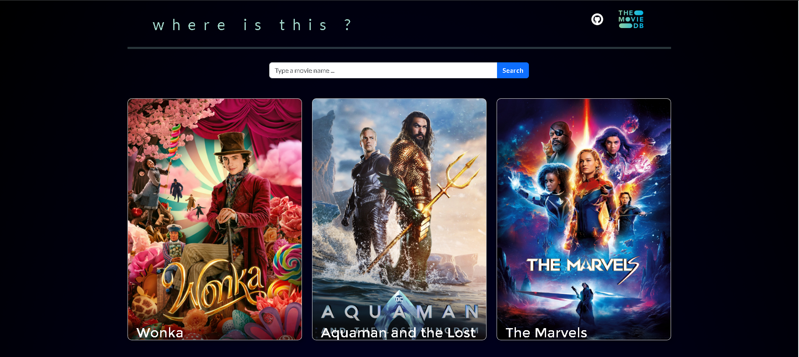
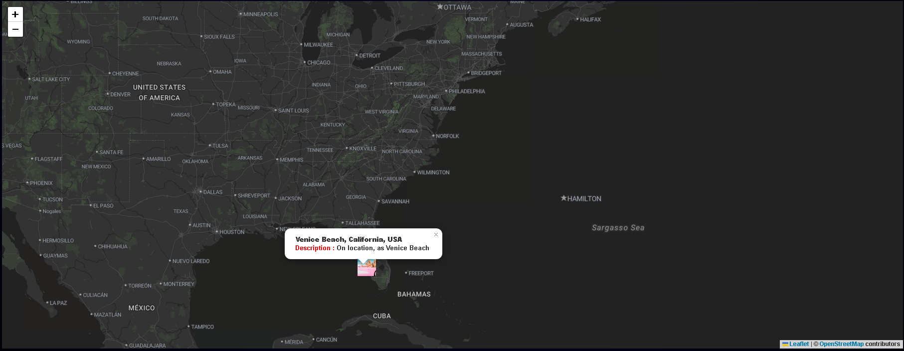

### [You can try the demo here](https://where-is-this.vercel.app/)

---

With this application, you can see where the movies were filmed on the map.

### Installation

```
git clone https://github.com/aktasevren/where-is-this.git

Create `.env` file in your root directory and add the following
REACT_APP_TMDB_API=<YOUR_TMDB_API>

cd where-is-this
npm install
```

#### How to Start

```
npm start
```




